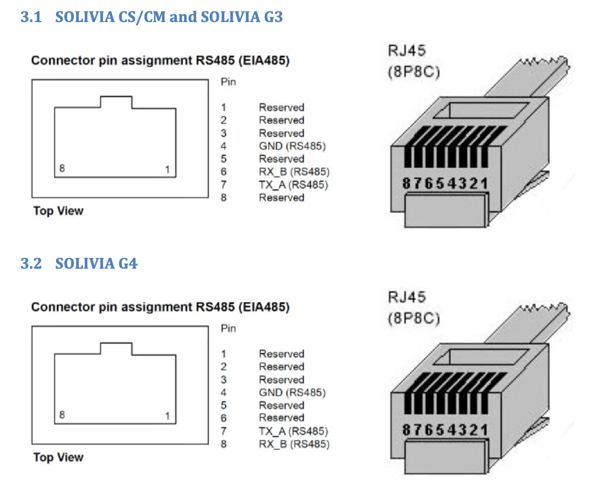

# Delta Solivia RS485 component for ESPHome

This component for ESPHome can be used to directly read measurement/statistics data from the RS485 port of _some_ Delta Solivia inverters. It does not require having a Solivia Gateway device, but will work if you have one.

## SYNOPSIS

The document "Public Solar Inverter Communication Protocol (Version 1.2)", from Delta Energy Systems (Germany) GmbH, documents the protocol that Delta Solivia inverters use over their RS485 port. There are dozens of Solivia models, and about 10 different protocol variants.

This component only supports one variant, supported by the following inverters:
* SOLIVIA 2.5 EU G3
* SOLIVIA 3.0 EU G3
* SOLIVIA 3.3 EU G3
* SOLIVIA 3.6 EU G3
* SOLIVIA 2.5 NA G4
* SOLIVIA 3.0 NA G4
* SOLIVIA 3.3 NA G4
* SOLIVIA 3.6 NA G4
* SOLIVIA 4.4 NA G4
* SOLIVIA 5.0 NA G4
* SOLIVIA 2.5 AP G3
* SOLIVIA 3.0 AP G3
* SOLIVIA 3.3 AP G3
* SOLIVIA 3.6 AP G3

The component does not perform any checks to see if it's talking to a supported inverter, but just assumes it does, so using it for a different type of inverter will probably cause the component to either crash or to provide incorrect data. Nothing bad will happen with your inverter if you do try this.

## HARDWARE

### MCU

The component should work on most ESP32 boards, and probably also ESP8266 boards, although I have only tested with ESP32-C3 "SuperMini" boards.

### RS-485 modules

#### MAX485-based RS-485-to-TTL modules

These modules are cheap and easy to get. They require explicit flow control (see below, "ESPHome setup") for the component to be able to write to the RS485 bus.

##### Pinout

| ESP32 | RS485 module | Purpose      |
|-------|--------------|--------------|
| GPIO4 | DI           | TX           |
| GPIO3 | RO           | RX           |
| GPIO2 | RE + DE      | Flow control |

#### Modules with automatic flow control

RS485 boards that have automatic flow control will take care of the correct signalling automatically.

### Connecting to the inverter

The inverter should have one or more ports that accept RJ45 ("Ethernet") connectors. The pinout depends on the inverter model (G3 or G4):



The TX_A and RX_B pins should connect to the A and B pins on the RS-485 module, respectively. The RS-485 GND pin isn't used.

If you don't have the necessary tools to crimp Ethernet cables, or you just want a quick solution, cut off a length of Ethernet cable with connector already attached and connect the TX_A and RX_B wires to the RS-485 module.

## ESPHome setup

```
# Load as external component
external_components:
  - source: github://robertklep/my-esphome-components
    components: [ delta_solivia ]

# UART setup (change tx_pin/rx_pin if required, leave the rest as-is)
uart:
  tx_pin: GPIO4
  rx_pin: GPIO3
  id: solivia_uart
  rx_buffer_size: 512
  baud_rate: 19200
  parity: NONE
  stop_bits: 1

# component setup
delta_solivia:
  # The UART configured above
  uart_id: solivia_uart

  # See below
  update_interval: 10s

  # See below
  has_gateway: false

  # Optional flow control pin, only configure this if your board doesn't have automatic flow control.
  # (before writing to the bus, the pin will be pulled up to assume control over the bus)
  flow_control_pin: GPIOX

  # Here you can configure multiple inverters.
  #
  # Each inverter has a unique address, usually starting with "1" for the
  # first inverter, "2" for the second, etc.
  #
  # You can run the component with debug logging in ESPHome enabled,
  # which will log information on the packets it receives, including
  # the address from which the packet originated.
  #
  # For each inverter, a number of sensors is available. If you're not
  # interested in a specific sensor, just leave it out.
  inverters:
    - address: 1
      throttle: 10s # see below
      part_number:
        name: 'Inverter#1 Part Number'
      serial_number:
        name: 'Inverter#1 Serial Number'
      ac_power:
        name: 'Inverter#1 Current Power'
      total_energy:
        name: 'Inverter#1 Total Energy'
      today_energy:
        name: 'Inverter#1 Today Energy'
      dc_voltage:
        name: 'Inverter#1 DC Voltage'
      dc_current:
        name: 'Inverter#1 DC Current'
      ac_voltage:
        name: 'Inverter#1 AC Voltage'
      ac_current:
        name: 'Inverter#1 AC Current'
      ac_frequency:
        name: 'Inverter#1 AC Frequency'
      grid_voltage:
        name: 'Inverter#1 Grid Voltage'
      grid_frequency:
        name: 'Inverter#1 Grid Frequency'
      runtime_hours:
        name: 'Inverter#1 Runtime Hours'
      runtime_minutes:
        name: 'Inverter#1 Runtime Minutes'
      max_ac_power_today:
        name: 'Inverter#1 AC Power Today'
      max_solar_input_power:
        name: 'Inverter#1 Solar Input Power'
    - address: 2
      part_number:
        name: 'Inverter#2 Part Number'
      serial_number:
        name: 'Inverter#2 Serial Number'
      ac_power:
        name: 'Inverter#2 Current Power'
      total_energy:
        name: 'Inverter#2 Total Energy'
      today_energy:
        name: 'Inverter#2 Today Energy'
      dc_voltage:
        name: 'Inverter#2 DC Voltage'
      dc_current:
        name: 'Inverter#2 DC Current'
      ac_voltage:
        name: 'Inverter#2 AC Voltage'
      ac_current:
        name: 'Inverter#2 AC Current'
      ac_frequency:
        name: 'Inverter#2 AC Frequency'
      grid_voltage:
        name: 'Inverter#2 Grid Voltage'
      grid_frequency:
        name: 'Inverter#2 Grid Frequency'
      runtime_hours:
        name: 'Inverter#2 Runtime Hours'
      runtime_minutes:
        name: 'Inverter#2 Runtime Minutes'
      max_ac_power_today:
        name: 'Inverter#2 AC Power Today'
      max_solar_input_power:
        name: 'Inverter#2 Solar Input Power'
```

There's also a full example YAML file [here](esphome-example-configuration.yaml).

#### With or without gateway

If you have a Solivia gateway, you need to set the `has_gateway` to `true`. It will let the component leave requesting updates to the gateway, to prevent having two primaries active on the bus.

The `update_interval` option of the component serves different purposes depending on whether you have a gateway or not. With a gateway, it will automatically be set to a low value (0.5s) to prevent missing updates sent by the inverters. Without a gateway, it will be the interval at which the component will request a single inverter (in a round-robin fashion) to send an update. The default of 10 seconds should be sufficient, although you can decrease it if you want faster updates or if you have more than one inverter.

The `throttle` option for each inverter will limit the amount of state updates sent back to HA. This is especially relevant if you have a gateway, since it will request updates for each inverter about every second (remember that each state update will also be stored in HA's database). The default throttle interval is 10 seconds. Internally, this is implemented using a [`throttle_average`](https://esphome.io/components/sensor/#throttle-average) filter.
